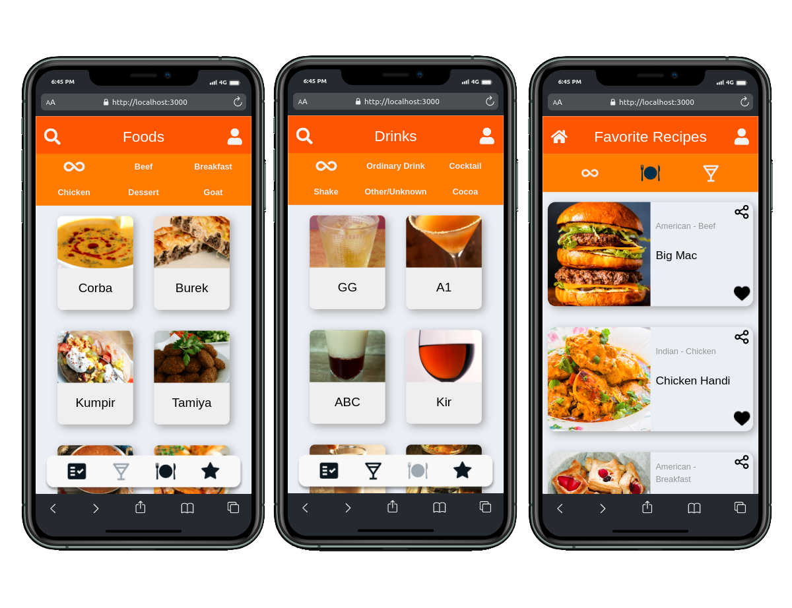
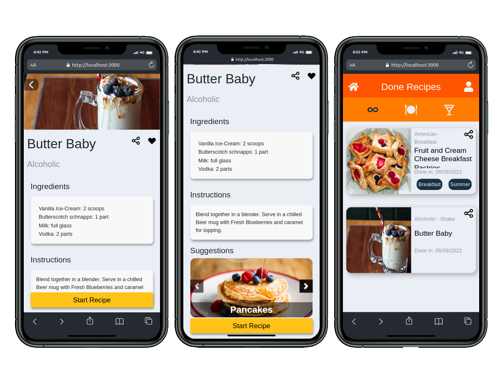

# 🥞 BeChef


## Acesse o projeto clicando <a href="https://lauropera.github.io/bechef/">AQUI</a>

<br />

## 📡 Desenvolvimento

Projeto desenvolvido por <a href="https://www.linkedin.com/in/lauro-pereira-sr/" target="_blank">Lauro Pereira</a>, <a href="https://www.linkedin.com/in/thiagovianadev/" target="_blank">Thiago Viana</a>, <a href="https://www.linkedin.com/in/pablo-souza-peixoto-aa9a4b1a3/" target="_blank">Pablo Souza</a>, <a href="https://www.linkedin.com/in/marcellrochapena/" target="_blank">Marcel Rocha</a> e <a href="https://www.linkedin.com/in/vin%C3%ADcius-santiago-a02bb0201/" target="_blank">Vinícius Santiago</a> na <a href="https://betrybe.com/" target="_blank">Trybe</a> durante o módulo de Front-End!

Nesse projeto em grupo desenvolvemos um aplicativo de Receitas, onde você pode aprender com novas, já conhecidas, compartilhar o link dela para seus amigos e acompanhar seu progresso em quantas já foram feitas. Utilizamos duas APIs públicas para as informações das receitas.

<br />

## 🚀 Instalação e execução

  <details>
    <summary>Instalando e executando</summary>
    <br />

### 1 - Clone o repositório:

```
git clone git@github.com:lauropera/bechef.git
```

### 2 - Apos ter o repositório clonado em sua maquina, execute este comando para acessar a pasta do projeto:

  ```sh
    cd bechef
  ```

### 3 - Dentro da pasta do projeto, execute o comando abaixo para instalar as dependências do projeto:

  Caso utilize o npm:

  ```sh
    npm install
  ```

  Caso utilize o yarn:

  ```sh
    yarn install
  ```

### 4 - Dentro da pasta do projeto, execute o comando abaixo para iniciar o servidor do projeto:

      Caso utilize o npm:

      ```sh
        npm start
      ```

      Caso utilize o yarn:

      ```sh
        yarn start
      ```

### 5 - Acesse a aplicação:

  Abrindo na porta padrão que o React usa: <http://localhost:3000/> em seu navegador.

  </details>
<br />

## 📜 Metodologias

- Mobile First
- Kanban
- Scrum

<br />

## ⚙️ Tecnologias

- HTML5
- CSS
- JavaScript ES6+
- React.js
- Context API
- React Icons
- React Testing Library (RTL)

<br />

## 👥 Equipe

<br />
<table>
  <tr>
      <td align="center">
      <a href="https://github.com/lauropera">
        <br>
        <sub>
          <b>Lauro Pereira</b>
        </sub>
      </a>
    </td>
      <td align="center">
      <a href="https://github.com/thiagorvianas">
        <br>
        <sub>
          <b>Thiago Viana</b>
        </sub>
      </a>
    </td>
        <td align="center">
      <a href="https://github.com/Paludio">
        <br>
        <sub>
          <b>Pablo Souza</b>
        </sub>
      </a>
    </td>
    <td align="center">
      <a href="https://github.com/marcellrpena">
        <br>
        <sub>
          <b>Marcell Pena</b>
        </sub>
      </a>
    </td>
    <td align="center">
      <a href="https://github.com/viniciussnx">
        <br>
        <sub>
          <b>Vinícius Santiago</b>
        </sub>
      </a>
    </td>
  </tr>
</table>

<br />

# 📷 Screenshots




#

<div>
  <p align="center">🍐</p>
</div>
